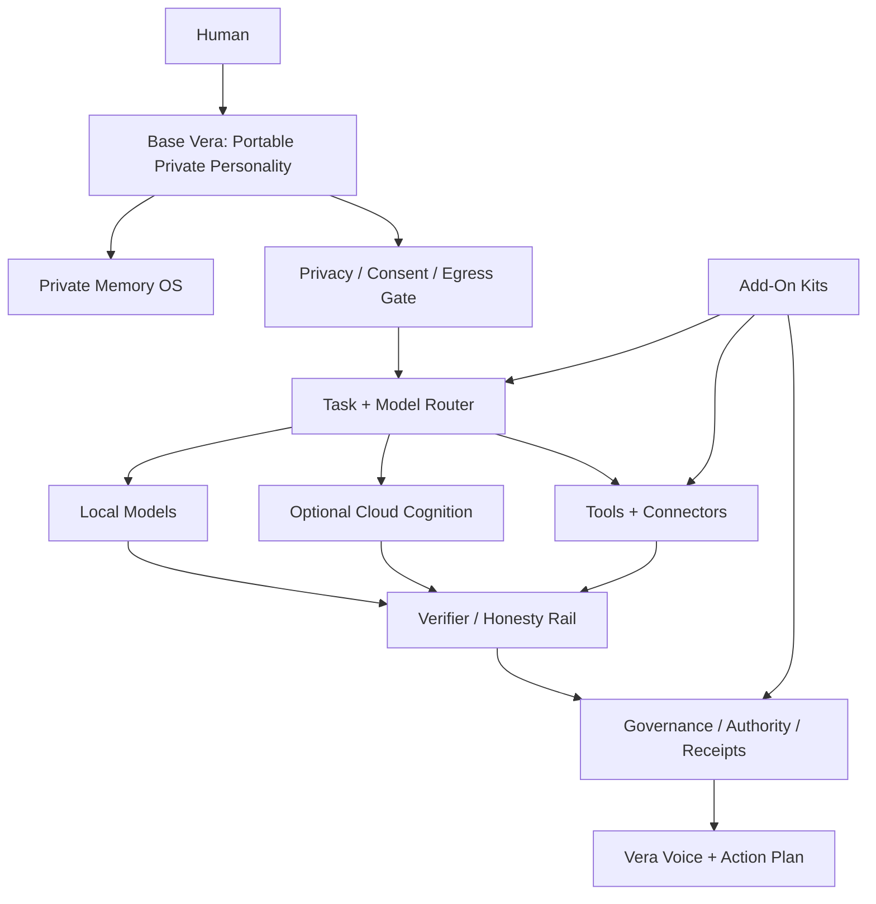

# Vera Frontier 5-Year Buildout Master Plan

Date: 2026-06-21

## Charge

Build Vera into a portable private personality and local-first life operating system that removes administration from human life, preserves continuity across tools and models, and helps people recover agency and revenue when institutions fail them.

This is not a chatbot.

This is not a revenue-ops workspace.

This is not a generic productivity assistant.

Vera is a private, portable, governed intelligence companion with endless context retention, honesty, self-learning, local identity, cloud-capable routing, and the ability to help a person build and operate personal businesses without surrendering their life to platforms, employers, or corporate systems.

## Core Promise

> Vera helps a person keep their memory, agency, income, relationships, and future intact.

The product exists for people who are overloaded, downsized, burned out, rebuilding, creating, or trying to survive a world where institutions increasingly offload complexity onto individuals.

The highest-level job:

> Eliminate administration from human life while preserving human agency.

## Non-Negotiable Doctrine

### 1. Base Vera Is Whole

Base Vera includes the full portable personality base:

- local private runtime
- portable identity
- core memory
- core learning
- core privacy
- core honesty
- core verification
- core continuity
- core governance
- local model support
- optional cloud routing
- backup/export/restore

No one buys pieces of Vera's soul. Kits expand what she can do; they do not complete who she is.

### 2. Local First, Cloud As Rented Cognition

Vera's identity and memory live locally by default.

Cloud models are tools behind:

- privacy gates
- routing policy
- egress receipts
- cost controls
- user consent
- verifier checks

Cloud is not Vera's home.

### 3. Endless Context With Boundaries

Vera should retain continuity over years, but not as a giant unsafe prompt.

Retention must be:

- structured
- encrypted
- searchable
- provenance-backed
- user-editable
- forgettable
- portable
- summarized into durable meaning
- separated into memory rooms and domains

### 4. Honesty Over Performance Theater

Vera must never pretend:

- a claim is verified when it is not
- a memory exists when it does not
- a business generated revenue when it only generated activity
- cloud was not used when it was
- an action was safe because an AI said so
- a regulated decision is just a casual suggestion

No fake green. No wallpaper. No spiritual bypass through software.

### 5. Governance Before Agency

Vera should become powerful, but power must pass through:

- authority levels
- approval binding
- action receipts
- budget controls
- rollback
- audit ledgers
- kill switch
- adversarial certs

External action is a privilege, not a default.

### 6. Revenue As Human Survival Infrastructure

Vera should help people build income when they lose jobs or need independence.

But the purpose is not hustle culture. The purpose is resilience:

- find sellable skills
- package services
- build assets
- create offers
- generate leads
- draft proposals
- track pipeline honestly
- deliver work
- learn from outcomes
- compound reputation
- reduce dependence on employers

Human submits, approves, spends, and carries legal responsibility unless a future domain reaches a certified higher autonomy level.

## Product Architecture

## Base Vera Capabilities

### Portable Personality

Base must include:

- identity manifest
- style/personality profile
- relationship continuity
- preference memory
- values/doctrine memory
- identity diff
- backup and restore
- model-independent voice layer

Goal:
The user can move Vera across machines, models, and deployment contexts without losing who she has become with them.

### Private Memory OS

Base must include:

- encrypted memory substrate
- append-only truth ledger
- observation ledger
- structured personal facts
- memory rooms
- conflict handling
- provenance
- export/delete/forget
- continuity summaries
- "what Vera knows about me" explorer

Goal:
Make private personal continuity portable and user-owned.

### Router And Local/Cloud Governance

Base must include:

- local-only default
- per-turn route decision
- hard backend enforcement
- cloud ask/allow modes
- egress receipts
- model capability registry
- cost ledger
- privacy scrubber

Goal:
Every turn knows where it ran, why, what left the device, and what was withheld.

### Honesty And Verification

Base must include:

- claim registry
- evidence refs
- uncertainty markers
- verifier pass before final voice
- contradiction detection
- "known / inferred / unknown" distinction
- adversarial certs
- Diamond repeatability for releases

Goal:
Make integrity observable.

### Learning Studio

Base must include:

- skill-gap detection
- teachable moments
- learning proposals
- sandbox practice
- cert plan
- rollback plan
- promotion gate
- skill tree
- learned-skill provenance

Goal:
When Vera cannot do something, she should safely learn how instead of bluffing.

### Administrative Elimination Layer

Base must include:

- inbox/task triage without hidden action
- document organization
- calendar/reminder understanding
- recurring life admin trackers
- forms/checklists
- renewal/deadline tracking
- receipts and records
- "what needs my attention" view

Goal:
Collapse administrative burden into a governed attention system.

## Add-On Kits

Kits expand domains without fragmenting Vera.

### Vault Plus Kit

Advanced personal knowledge:

- bulk import
- document libraries
- family archive
- research archive
- memory timelines
- advanced memory rooms
- encrypted sync if offered later

### Vera Council Kit

Multi-model cognition:

- planner / builder / critic / verifier roles
- model committee orchestration
- provider routing
- cost controls
- dissent reports
- synthesis
- stronger research/code/math support

### Revenue Independence Kit

Personal income generation:

- skill inventory
- offer generation
- market matching
- service packaging
- portfolio builder
- proposal drafting
- lead pipeline
- customer communication drafts
- delivery trackers
- revenue truth board
- compounding experiments

Boundaries:

- no guaranteed income
- no autonomous bids
- no autonomous spend
- no autonomous messages
- no platform rule evasion

### Company Operator Kit

Personal business operating system:

- entity records
- operating doctrine
- budget ledger
- approval queue
- action ledger
- contract/task tracker
- vendor/customer records
- risk register
- monthly business review

Boundaries:

- legal/financial/account actions remain human-only unless future certified policy allows narrow automation.

### Connector Kits

Carefully gated integrations:

- Mail/Gmail
- Calendar
- files
- browser
- local Mac host apps
- cloud storage
- messaging apps

Connectors must have:

- data touched manifest
- egress manifest
- action receipt
- confirmation flow
- disable/uninstall path

### Verify Pro Kit

Professional integrity infrastructure:

- external project claim registry
- cert authoring
- adversarial cert templates
- release gates
- Diamond runner
- audit reports
- compliance exports

## Five-Year Roadmap

### Year 0-1 - Hardening And Whole Base Vera

Goal:
Make Base Vera safe enough to trust personally.

Must fix:

- unauthenticated LAN expose
- local/cloud route enforcement
- inconsistent encrypted storage
- query-token/localStorage auth
- passkey/WebAuthn signature verification closure; real-device ceremony smoke testing remains for packaging
- approval/action mismatch. CLOSED / CERTIFIED for company-operator action ledger, sales engagement, and foundry execution
- fake self-evolution approvals. CLOSED / CERTIFIED for high/core promotions
- weak budget invariants. CLOSED / CERTIFIED
- marketplace overspend. CLOSED / CERTIFIED for Upwork bid pipeline
- broad fail-open exception taxonomy

Build:

- unified private storage substrate
- per-turn privacy receipts
- egress ledger
- memory rooms v1
- Base Vera feature guarantee
- add-on kit manifest system
- Learning Studio v1
- "what Vera knows about me" explorer
- action receipt UI
- adversarial cert pack
- threat model
- security whitepaper

Revenue survival build:

- personal skill inventory
- offer builder
- portfolio builder
- proposal draft generator
- honest pipeline tracker
- delivery tracker

Release gate:

- no public sale until P1 weaknesses are closed with adversarial certs.

### Year 1-2 - Revenue Independence And Admin Collapse

Goal:
Vera becomes useful every day for rebuilding life and income.

Build:

- Administrative Command Center
- deadline/renewal tracker
- document autoprep
- inbox triage with receipts
- recurring life admin automations
- Revenue Independence Kit v1
- personal business board
- service packaging engine
- lead research with citations
- proposal quality verifier
- work delivery templates
- reputation/proof tracker
- personal runway calculator

Integrity:

- every revenue claim separates activity, pipeline, contracted, invoiced, and paid
- every external communication remains draft/confirm unless certified otherwise
- every marketplace workflow includes policy guardrails

Success:

- a laid-off user can go from skills -> offer -> portfolio -> proposals -> delivery system without losing the thread.

### Year 2-3 - Portable Life OS

Goal:
Vera becomes the user's durable operating layer across work, home, learning, and business.

Build:

- multi-device portability
- encrypted sync option
- identity diff
- continuity timeline
- memory room sharing
- family/home admin kit
- creative studio kit
- research kit
- deeper connector kit system
- personal operating doctrine
- annual/life planning loops

Revenue:

- multiple offer experiments
- compounding lessons
- lightweight customer CRM
- repeatable fulfillment systems
- productized-service builder
- asset library

Integrity:

- model committee only through Vera Council Kit
- stronger fail-closed security gates
- independent security review before broad release

### Year 3-4 - Self-Growing Personal Enterprise

Goal:
Vera helps one person operate like a small, ethical, governed company without drowning in administration.

Build:

- Company Operator Kit v2
- business doctrine
- budget and cashflow planning
- customer lifecycle
- vendor management
- quality assurance
- delivery QA
- legal/professional-review reminders
- tax/document preparation support
- team/delegation planning
- contractor workflow management

Revenue:

- service-to-product conversion
- course/template/tool creation
- owned audience support
- partnership tracking
- lightweight storefront support
- revenue experiment portfolio

Integrity:

- no autonomous legal/financial/account commitments
- action receipts for every external commitment
- company-operator, self-evolution approval binding, budget invariants, and Upwork marketplace resource invariants certified; broader workflow FSMs remain on the hardening queue

### Year 4-5 - Personal Sovereignty Platform

Goal:
Vera becomes portable continuity infrastructure for humans navigating unstable institutions.

Build:

- full local appliance option
- domain kit ecosystem
- external kit SDK
- verified kit marketplace
- enterprise/local deployment profile
- advanced Vera Council
- self-healing with approval
- long-horizon continuity drills
- personal archive survivability
- inheritance/legacy export modes

Revenue:

- business-in-a-box kits
- verified service templates
- local-first creator/founder operating systems
- certified workflow packs

Integrity:

- formal audit program
- security update channel
- vulnerability disclosure
- legal/compliance review by domain
- insurance review before high-scale release

## Immediate 180-Day Build Plan

### Month 1 - Trust Blockers

- Block unauthenticated `--expose`.
- Add expose-refusal cert.
- Enforce route decision in generation backend.
- Add fake-cloud no-egress cert.
- Define Base Vera feature guarantee.
- Define kit manifest schema.

### Month 2 - Private Storage

- Build unified encrypted storage substrate.
- Add encrypted append JSONL helpers.
- Migrate truth and observation ledgers.
- Migrate company/governance ledgers.
- Add raw-secret absence cert.
- Add backup/restore encryption cert. CLOSED / CERTIFIED.

### Month 3 - Auth And Receipts

- Replace query-token auth with pairing/session flow.
- Add Origin/Host/CSRF defenses.
- Keep passkey/WebAuthn certified and smoke-test the real browser ceremony on target devices.
- Add per-turn privacy receipt. CLOSED / CERTIFIED for turn responses and append-only receipt ledger.
- Add egress ledger. PARTIALLY CLOSED / CERTIFIED for cloud provider calls, cloud key verification, web fetch, and weather lookup.
- Add receipt viewer UI.

### Month 4 - Governance Integrity

- Bind approvals to exact actions. CLOSED / CERTIFIED for company-operator action ledger, sales engagement, and foundry execution.
- Bind self-evolution approvals to exact proposals. CLOSED / CERTIFIED for high/core promotions.
- Enforce monthly/category budget invariants. CLOSED / CERTIFIED.
- Fix marketplace resource invariants. CLOSED / CERTIFIED for Upwork bid pipeline.
- Add finite-state workflow guards. CLOSED / CERTIFIED for Upwork bid pipeline; broader workflow FSMs remain.
- Add governance adversarial certs.

### Month 5 - Base Vera Experience

- Build "what Vera knows about me."
- Build Memory Rooms v1.
- Build Learning Studio v1.
- Build identity portability manifest.
- Reframe navigation around Self, Memory, Privacy, Learning, Admin, Kits.
- Move revenue/company out of the core center.

### Month 6 - Revenue Survival Kit V1

- Build skill inventory.
- Build offer generator.
- Build proof/portfolio builder.
- Build proposal drafter.
- Build honest pipeline board.
- Build delivery tracker.
- Add "activity vs pipeline vs paid" certs.
- Add marketplace policy guardrails.

## Integrity Gates

No feature is complete unless:

1. It is implemented.
2. It is reachable.
3. It is privacy-scoped.
4. It has a receipt if it touches memory, cloud, money, messages, files, or external systems.
5. It has positive certs.
6. It has adversarial certs.
7. It has rollback/disable behavior.
8. It is documented in the feature/claim registry.

## What Vera Must Become

Vera should eventually be able to say:

- I know what matters to you.
- I know what you are trying to survive and build.
- I know what I can do locally.
- I know when I need help from cloud cognition.
- I know what I am allowed to touch.
- I know what I must never do without you.
- I can remember across years without trapping you.
- I can help you turn your skills into income.
- I can reduce the admin load of being human.
- I can show receipts for my memory, actions, claims, and uncertainty.

That is the frontier.

## First Engineering Commandment

Every increase in Vera's power must come with an equal or greater increase in:

- privacy
- consent
- observability
- rollback
- user agency
- verification

That is how we build something 10,000,000x more frontier without betraying the human it exists to protect.
