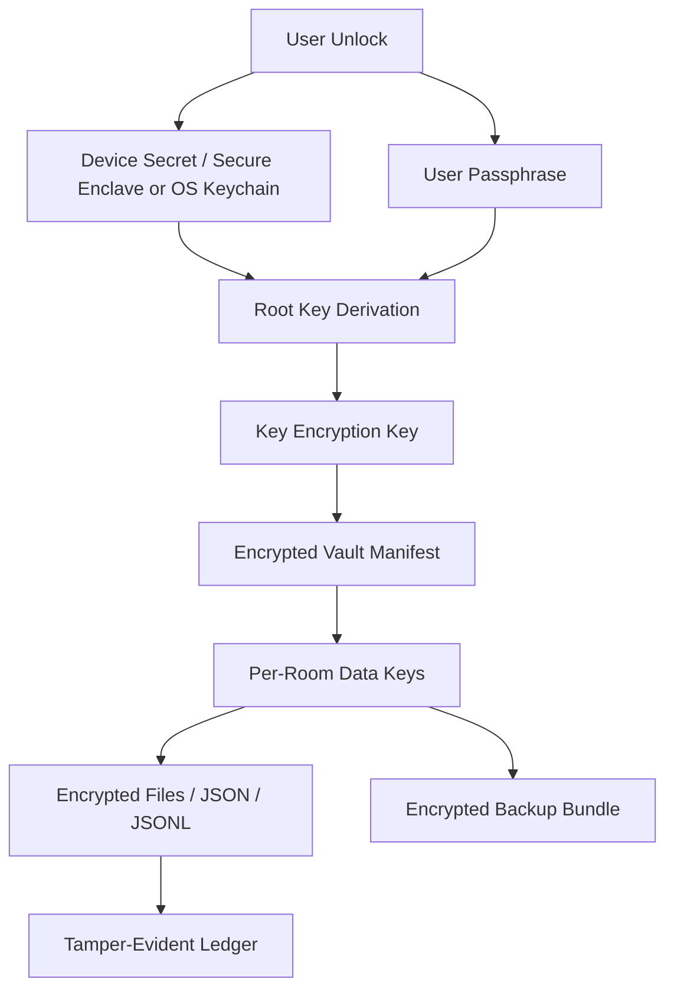

# Vera Sovereign Security Architecture

Date: 2026-06-21

Purpose: define the security architecture required for Vera as a portable private personality with lifelong memory, local models, context retention, revenue tooling, and business-operating capability.

## Core Security Promise

If a laptop is lost, stolen, imaged, or copied, the attacker should not be able to recover:

- Vera's identity/personality base
- user memory
- truth/observation ledgers
- private files
- business records
- revenue pipelines
- cloud/API keys
- local model personalization artifacts
- kit data
- action ledgers
- backups

The attacker should get encrypted noise, tamper-evident records, and no usable runtime authority.

## Important Correction

We should not invent a new encryption algorithm or stack 20 ciphers blindly.

That sounds stronger, but it often creates fragile systems:

- bad nonce handling
- incompatible modes
- weak key derivation
- broken error behavior
- side-channel leaks
- unrecoverable data
- impossible audits
- false confidence

The mind-blowing version is not homemade crypto. It is a sovereign security architecture built from proven primitives, layered key custody, compartmentalization, tamper evidence, crypto-agility, and adversarial certs that prove no plaintext leaks.

Reference direction:

- NIST standardizes cryptographic primitives and post-quantum algorithms such as ML-KEM for key establishment and ML-DSA for signatures.
- OWASP guidance emphasizes cryptographic storage, key lifecycle management, key storage, compromise handling, and secret management.
- Vera should use established libraries and standards, but assemble them into a product architecture that ordinary users can actually trust.

## Security Philosophy

### 1. Defense In Depth, Not Cipher Piling

Use multiple layers with different jobs:

- full disk encryption
- app-level encrypted vault
- per-room keys
- per-file authenticated encryption
- key wrapping
- hardware-backed unlock
- passphrase recovery policy
- tamper-evident logs
- encrypted backups
- no-plaintext tests

### 2. Compartmentalize Memory

No one key should unlock the whole life if it can be avoided.

Memory should be divided into compartments:

- core identity
- relationship memory
- private journal
- business records
- revenue pipelines
- connector caches
- cloud receipts
- kit data
- temporary working context
- public/exportable data

Each compartment gets its own data encryption key.

### 3. User-Held Root

Collatio should not hold the user's root secrets by default.

The user should control:

- root recovery passphrase
- local device unlock
- optional hardware security key
- backup recovery bundle
- cloud provider API keys

### 4. Fail Closed

If Vera cannot decrypt or verify a private store, she should not silently fall back to plaintext or defaults.

Security, consent, egress, spending, host actions, and self-evolution gates must fail closed.

### 5. Receipts For Trust

Every sensitive operation should leave a receipt:

- what was decrypted
- what was read
- what left the device
- what model was used
- what action was proposed
- what key/room was touched
- what was exported

## Proposed Vault Architecture



## Cryptographic Layers

### Layer 1 - Platform Disk Protection

Use OS-level full disk encryption:

- macOS FileVault
- hardware-backed device unlock where available

This is not enough by itself. It protects a powered-off disk, but Vera still needs app-level vault security.

### Layer 2 - App-Level Vault

All private Vera stores live inside an encrypted vault.

Use authenticated encryption:

- AES-256-GCM or XChaCha20-Poly1305 through a vetted library
- unique nonce per encryption
- associated data for file path, schema, room id, and version
- no unauthenticated encryption

### Layer 3 - Key Hierarchy

Key hierarchy:

- Root Unlock Material:
  - user passphrase
  - OS keychain / secure enclave secret
  - optional hardware security key
- Key Encryption Key:
  - derived through memory-hard KDF
- Vault Master Key:
  - random, wrapped by KEK
- Room Keys:
  - random per memory room / kit / domain
- File Keys:
  - optional random per object for high sensitivity

### Layer 4 - Memory Rooms

Each room has separate keys:

- Core Identity Room
- Personal Memory Room
- Business Room
- Revenue Room
- Connector Cache Room
- Temporary Working Room
- Export/Public Room

If a kit is disabled, its room key can be locked without harming Base Vera.

### Layer 5 - Tamper Evidence

Every append-only ledger should be:

- encrypted
- hash-chained
- signed or MACed
- sequence-numbered
- timestamped
- checked on load

If a ledger line is missing, altered, reordered, or forged, Vera should report tamper/corruption.

### Layer 6 - Secrets Vault

API keys and tokens need separate treatment:

- stored in OS keychain where possible
- wrapped with app vault key if stored in files
- never exported by default
- never shown in UI after entry
- scoped by provider/domain
- revocation instructions stored
- cloud calls logged without leaking the secret

### Layer 7 - Backup And Recovery

Backups must be encrypted before leaving the device.

Backup bundle:

- encrypted vault snapshot
- encrypted key manifest
- public metadata only where safe
- recovery instructions
- integrity hash
- version
- restore drill cert

Recovery modes:

- passphrase recovery
- hardware key recovery
- printed recovery code
- split recovery option for advanced users

No recovery design should allow Collatio to decrypt a user's vault by default.

### Layer 8 - Crypto Agility

Vera must be able to migrate algorithms.

Every encrypted object should carry:

- algorithm id
- KDF id
- parameters
- key id
- nonce
- schema version
- room id
- created_at

This lets us migrate from one primitive to another without breaking old vaults.

### Layer 8B - Controlled Cipher Rotation

The useful version of "rotating random ciphers" is controlled cipher rotation, not unaudited randomness.

Bad version:

- randomly pick from many ciphers per write
- layer unknown combinations
- hide which algorithms were used
- make recovery depend on code behavior instead of explicit metadata
- use experimental primitives

Good version:

- maintain a short approved cipher-suite registry
- assign a suite id to every encrypted object
- rotate suites by policy, room, time, or sensitivity
- store the suite id and parameters in the encrypted envelope metadata
- sign/MAC the envelope metadata as associated data
- test every suite with known-answer and round-trip certs
- keep migration tools for old suites
- deprecate suites safely when standards change

Approved-suite example:

```json
{
  "suite_id": "vera-aead-2026-a",
  "aead": "AES-256-GCM",
  "kdf": "Argon2id",
  "key_wrap": "XChaCha20-Poly1305",
  "nonce_policy": "random-96-bit-per-object",
  "status": "active"
}
```

Alternative suite example:

```json
{
  "suite_id": "vera-aead-2026-b",
  "aead": "XChaCha20-Poly1305",
  "kdf": "Argon2id",
  "key_wrap": "AES-256-GCM",
  "nonce_policy": "random-192-bit-per-object",
  "status": "active"
}
```

Rotation policy:

- Core Identity Room: conservative suite, slow rotation, heavily tested.
- Temporary Working Room: frequent key rotation, short retention.
- Connector Cache Room: aggressive expiration and rotation.
- Business/Revenue Rooms: standard rotation plus tamper-evident ledger.
- Backup Bundles: stable long-term suite plus migration manifest.

This gives Vera the "shifting armor" feeling without sacrificing auditability.

### Layer 9 - Post-Quantum Readiness

For local at-rest encryption, symmetric encryption with 256-bit keys remains the main foundation.

Post-quantum matters most for:

- device pairing
- sync
- backup sharing
- remote activation
- signed updates
- future encrypted transport

Plan:

- design crypto-agile envelopes now
- use hybrid classical + post-quantum key exchange later where applicable
- consider ML-KEM for future key establishment
- consider ML-DSA/SLH-DSA for future signatures and update verification

### Layer 10 - Runtime Lockdown

Encryption at rest does not protect data while Vera is unlocked.

Runtime requirements:

- auto-lock
- memory zeroization for key material where feasible
- process permission minimization
- no plaintext temp files
- encrypted swap warning if OS settings weak
- debug logs scrubbed
- crash dumps disabled/scrubbed
- clipboard caution for secrets
- no hidden telemetry

## "20 Deep" Reframed

Instead of 20 stacked ciphers, build 20 independent security controls:

1. FileVault/OS full disk encryption.
2. App-level encrypted vault.
3. Memory-hard passphrase KDF.
4. OS keychain/secure enclave binding.
5. Optional hardware security key.
6. Vault master key wrapping.
7. Per-room data keys.
8. Optional per-file keys.
9. Authenticated encryption only.
10. Tamper-evident hash-chained ledgers.
11. Signed/MACed vault manifest.
12. Encrypted backups.
13. No Collatio custody of root secrets.
14. Zero-egress mode.
15. Per-turn privacy receipts.
16. Secrets vault for API keys.
17. Fail-closed security gates.
18. No-plaintext adversarial certs.
19. Crypto-agile envelope versions.
20. Post-quantum-ready pairing/sync/update roadmap.
21. Controlled cipher-suite rotation with signed envelope metadata.

This is stronger, more auditable, and more credible than "20 encryptions."

## Product Features That Will Blow Minds

### Panic Seal

One click locks all private rooms, drops cloud routes, disables connectors, and requires full unlock.

### Travel Mode

Temporarily removes or locks sensitive rooms before travel or device repair.

### Decoy Profile

Optional low-risk visible profile while the real vault remains sealed. This needs legal and safety review before implementation.

### Memory Rooms

Each life domain has its own key, policies, receipts, and export behavior.

### Proof Of No Plaintext

User can run a local proof scan showing private raw text does not appear in Vera's store.

### Privacy Receipt Timeline

A readable timeline of every memory read, cloud call, export, connector access, and action proposal.

### Sovereign Backup Drill

Vera periodically proves she can restore from encrypted backup without Collatio.

### Dead-Man / Legacy Export

Optional user-controlled inheritance/export workflow. Must be extremely careful and opt-in only.

## Immediate Engineering Plan

### Phase 1 - Stop Plaintext Leaks

- Build `anima/secure_store.py`.
- Add encrypted JSON, text, binary, and append-jsonl APIs.
- Migrate `truth.ledger`.
- Migrate `observation.store`.
- Migrate `company.storage`.
- Migrate consent, telemetry, curiosity, verification run records.
- Add no-plaintext cert with synthetic secrets.

### Phase 2 - Vault Manifest And Room Keys

- Define vault manifest schema.
- Add room id to private stores.
- Generate per-room keys.
- Wrap room keys under vault master key.
- Add lock/unlock lifecycle.

### Phase 3 - Auth And Device Binding

- Pairing/session auth.
- Full WebAuthn or honest device-presence naming.
- Optional hardware key support.
- Auto-lock.
- Panic seal.

### Phase 4 - Tamper-Evident Ledgers

- Hash chain truth ledger.
- Hash chain observation ledger.
- MAC or signature per segment.
- Cert ledger tamper detection.

### Phase 5 - Backup And Recovery

- Encrypted backup bundles. CLOSED / CERTIFIED in `anima/vault_backup.py`.
- Restore drill. CLOSED / CERTIFIED by `scripts/certify_encrypted_backup_restore.py`.
- Recovery code.
- Wrong-key detection.
- No Collatio custody mode.

### Phase 6 - Crypto Agility And PQ Readiness

- Envelope versioning.
- Algorithm registry.
- Migration tool.
- Hybrid pairing/sync design.
- Signed update chain.

## Cert Requirements

Must add:

- `certify_secure_store_no_plaintext.py`
- `certify_encrypted_jsonl_append.py`
- `certify_vault_wrong_key_fails_closed.py`
- `certify_room_key_isolation.py`
- `certify_panic_seal.py`
- `certify_no_plaintext_tempfiles.py`
- `certify_encrypted_backup_restore.py`
- `certify_tamper_evident_ledger.py`
- `certify_secret_vault_no_ui_leak.py`
- `certify_zero_egress_security_mode.py`
- `certify_cipher_suite_registry.py`
- `certify_cipher_rotation_roundtrip.py`
- `certify_deprecated_suite_read_only_migration.py`

## Security Claim Rules

Do not claim:

- "unbreakable"
- "military grade" as a vague marketing phrase
- "DOD level"
- "20 encryptions deep"
- "impossible to hack"

Claim only what we can prove:

- encrypted local vault
- user-held keys
- no Collatio custody by default
- per-room key separation
- tamper-evident ledgers
- encrypted backups
- no-plaintext certs
- zero-egress hard switch for cloud/web/weather
- privacy receipts

## North Star

The right phrase is not "DOD level."

The right phrase is:

> Sovereign memory security.

Vera should make a user's private life portable without making it stealable.
